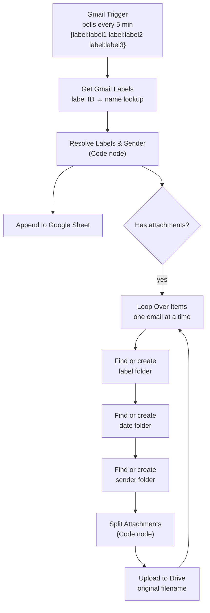
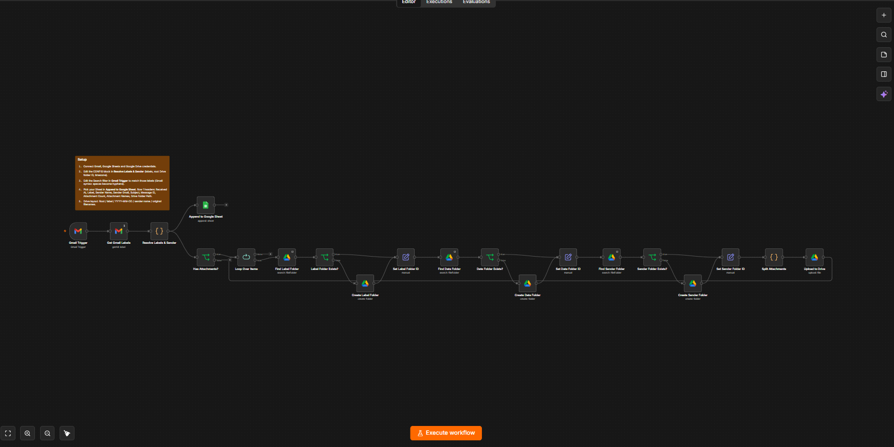

# Multi-Label Gmail → Google Sheets & Drive Automation

An [n8n](https://n8n.io) workflow that watches a Gmail inbox for emails under several labels, logs each sender's details to a Google Sheet, and files every attachment in Google Drive, organised by label, date received and sender, with the original filenames intact.

<!-- Add your demo GIF or video link here -->


## The problem

Emails arrive under different labels (clients, invoices, applications, and so on) and their attachments pile up in the inbox. Finding "the file that Alex sent last Tuesday under the invoices label" means searching manually. This workflow does the filing automatically and keeps a searchable log of who sent what.

## What it does

1. Polls Gmail every 5 minutes for new emails under any of the configured labels (`label1`, `label2`, `label3`, and so on).
2. Extracts the sender name, sender email, subject, received time, label and attachment list.
3. Appends one row per email to a Google Sheet.
4. Downloads any attachments and uploads them to Google Drive with their **original filenames**, into this structure:

```
Root folder/
└── label1/
    └── 2026-09-21/
        └── Sender Name/
            ├── invoice.pdf
            └── receipt.png
```

Folders are created only if they don't already exist, so repeat senders reuse the same folder.

## Architecture



<!-- Add a screenshot of your n8n canvas here -->


## Google Sheet output

| Column | Content |
|---|---|
| Received At | Date and time received (Asia/Manila by default) |
| Label | Matched Gmail label |
| Sender Name | Display name of the sender |
| Sender Email | Sender's email address |
| Subject | Email subject |
| Message ID | Gmail message ID |
| Attachment Count | Number of attachments |
| Attachment Names | Comma-separated original filenames |
| Drive Folder Path | `label/date/sender`, if there were attachments |

## Design decisions

**Matching several labels with one trigger.** The Gmail Trigger's label filter requires an email to have *all* the selected labels. To match *any* label, the trigger uses Gmail's search syntax instead: `{label:label1 label:label2 label:label3}`. The braces mean OR. A single trigger also keeps its own record of which emails it has already seen, so nothing is processed twice.

**Mapping label IDs to names.** Gmail returns label IDs (like `Label_123`), not names. A Get Labels node fetches the ID-to-name map once per run, and a Code node uses it to work out which configured label each email matched.

**Processing one email at a time for Drive.** Drive's search-then-create pattern is not atomic. If two emails from the same sender arrive in one poll, n8n would search for the folder for both, find nothing, and create it twice. Loop Over Items with a batch size of 1 makes each email finish its folder lookups before the next begins, so folders are reused.

**Find-or-create folder chain.** Each level (label, date, sender) does a Drive search scoped to its parent folder. If the search finds nothing, a Create Folder node runs, and both paths merge into a node that outputs the folder ID for the next level.

**Re-attaching binary data.** The Google Drive nodes return only JSON, so the email's attachment files are lost after the folder chain. The Split Attachments Code node pulls them back from the loop's input and emits one item per attachment, using the filename Gmail supplied.

**Sheet logging in a parallel branch.** Logging to the sheet doesn't depend on Drive, so it runs on its own branch. A Drive error doesn't stop the row from being written.

## Setup

1. Import `workflow/gmail-labels-to-sheets-drive.json` into n8n (Workflows → Import from File).
2. Create Google OAuth2 credentials for Gmail, Google Sheets and Google Drive, and attach them to the matching nodes.
3. Create a root folder in Drive and copy its ID from the URL.
4. Edit the `CONFIG` block in the **Resolve Labels & Sender** node:
   - `TARGET_LABELS`: your label names
   - `ROOT_FOLDER_ID`: the Drive folder ID
   - `TZ`: your timezone
5. In **Gmail Trigger**, set the Search filter to match those labels. Gmail search writes spaces in label names as hyphens.
6. Create a Google Sheet with a tab named `Emails` and the nine column headers above in row 1. Select it in **Append to Google Sheet**.
7. Activate the workflow.

If you run n8n locally, use `http://localhost:5678` for the Google OAuth redirect URI: `http://localhost:5678/rest/oauth2-credential/callback`. The Gmail Trigger polls, so no public URL is needed.

## Testing

See [docs/test-plan.md](docs/test-plan.md) for the test cases and results.


## Tech

n8n · Gmail API · Google Sheets API · Google Drive API · JavaScript (n8n Code nodes)

## Author

<!-- Your name, portfolio link and LinkedIn -->
